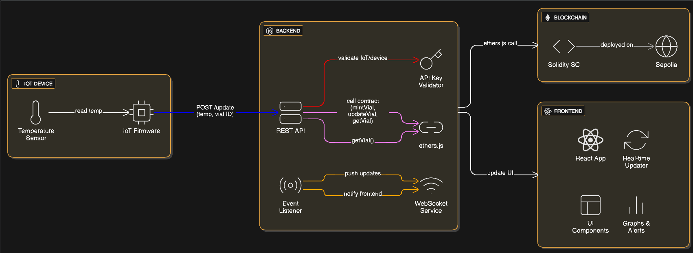

# 🧪 DeDiT – Decentralized Digital Twin for Vaccine Vials  
Smart, autonomous vaccine monitoring that runs **fully on-chain**, powered by Spolia Testnet + React.

Live demo, architecture diagram, deployed code, and complete setup instructions included below.

---

# 🌐 **Working Demo**
👉 **https://dedit.netlify.app**  

---

# 🚦 **Problem → Solution → Demo Steps**

## ❌ Problem  
Vaccines are extremely temperature-sensitive.  
Traditional cold-chain systems depend on **manual logs**, delayed reporting, and no real-time alerts — resulting in spoilage, wastage, and safety risks.

## ✅ Solution  
**DeDiT** creates a **Digital Twin NFT** for every physical vaccine vial.

Each twin automatically records:
- Temperature  
- Potency  
- Spoilage state  
- Timestamp  

And stores it directly **on-chain**, tamper-proof and trustless.

The system provides:
- Live temperature monitoring  
- Real-time spoilage alerts  
- Automatic potency degradation logic  
- Smooth visualization and graphs  

## ▶️ Demo Steps  
1. Connect (mock) wallet.  
2. Load an existing vial OR mint a new one.  
3. Watch temperature auto-update every 5 seconds.  
4. Observe live graph refresh every 4 seconds.  
5. If the vial overheats → contract marks it **SPOILED** and auto-updates stop.  

---

# 🏗️ **System Architecture**

Below is the exact architecture used in DeDiT:



---

# 🛠️ Tech Stack

### **Frontend**
- React + TypeScript  
- TailwindCSS  
- Recharts  
- Lucide Icons  

### **Backend**
- Node.js + Express  
- Ethers.js  
- REST API  

### **Blockchain**
- Solidity Smart Contract  
- NFT Digital Twin  
- Deployed on Arbitrum Stylus (or Sepolia for demo)

---

# 🔥 Features

### 🧊 Real-Time Monitoring  
- Auto temperature generation every **5 seconds**  
- Auto-refresh graph every **4 seconds**  
- Smooth UI animations  

### 🧬 Digital Twin NFT  
Each vial NFT tracks:  
- `temperature`  
- `potency`  
- `spoiled`  
- `lastUpdated`  

### ⚠️ Spoilage Detection  
If temperature goes out of range:  
- Smart contract marks vial **SPOILED**  
- Frontend stops sending temperature updates  
- Glowing red UI alert activated  

---

# 🖥️ **How to Run the Project**

## 📁 Folder Structure
```
/client     → React + TypeScript frontend
/server     → Node.js + Express backend
```

---

# ⚙️ **Backend Setup (/server)**

### 1️⃣ Install dependencies
```bash
cd server
npm install
```

### 2️⃣ Add `.env`
```
SEPOLIA_RPC_URL=<your_rpc_url>
PRIVATE_KEY=<wallet_private_key>
CONTRACT_ADDRESS=<deployed_contract_address>
```

### 3️⃣ Start backend
```bash
node server
```

Backend runs on:
```
http://localhost:5000
```

---

# 🖥️ **Frontend Setup (/client)**

### 1️⃣ Install dependencies
```bash
cd client
npm install
```

### 2️⃣ Start frontend
```bash
npm run dev
```

Frontend runs on:
```
http://localhost:5173
```

---

# 📡 **API Endpoints**

### `GET /vial/:id`  
Fetch vial state (temperature, potency, spoiled).

### `POST /update`  
Update temperature.

### `POST /mint`  
Mint a new vial NFT.

---


# 🔮 **Future Enhancements**
- Hardware IoT + ESP32 integration  
- SMS + Email alerts  
- Multi-vial dashboard  
- QR-based vial scanning  
- GPS-based live cold-chain tracking  

---

# 📄 License
MIT License © 2025 DeDiT  
